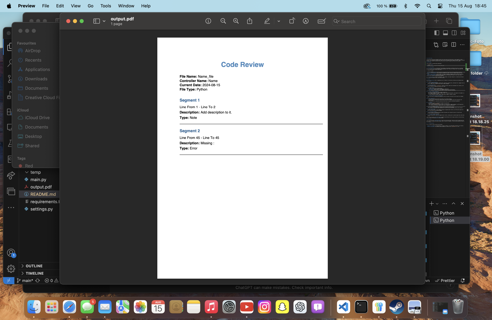

# Code Review App

A Python-based application designed to assist with code reviews by allowing users to input segments of code, annotate them, and generate a detailed PDF report. This tool provides a user-friendly interface, supports multiple languages, and integrates seamlessly with your workflow to ensure thorough and efficient code reviews.
## Screenshots

### Main Window

### Settings Window

### PDF Example

## Project Description

The **Code Review App** is a versatile and user-friendly tool designed to streamline the process of reviewing code. With support for multiple languages, including English (En), Slovak (Sk), Spanish (Es), and German (De), this application adapts to diverse user needs. 

Key features include:

- **Built-in Settings Window:** Easily customize the app’s settings with an intuitive graphical interface.
- **Auto-Save Functionality:** Your settings are automatically saved, ensuring a seamless experience across sessions.
- **Report Problem by Email:** Quickly report any issues or feedback by sending an email directly from the app.
- **Beautiful PDF Design:** Generate detailed and aesthetically pleasing PDF reports of your code reviews, featuring clean layouts and professional typography.

The **Code Review App** is ideal for developers, code reviewers, and teams looking for a reliable and efficient way to manage and document their code review processes.

## Features

The **Code Review App** offers a comprehensive set of features to facilitate an effective and streamlined code review process:

### 1. **Multi-Language Support**
   - The app supports four languages: English (En), Slovak (Sk), Spanish (Es), and German (De). Language files are stored in JSON format, making it easy to add or modify languages.

### 2. **Customizable UI**
   - The application uses the `customtkinter` library to provide a modern and customizable user interface, with options to adjust the appearance mode and color theme.

### 3. **Sidebar Menu**
   - The sidebar includes the following options:
     - **Open GitHub:** Quickly access the developer's GitHub page.
     - **Send Email:** Report issues or send feedback directly via a pre-filled email.
     - **Open Settings:** Launch a settings window to configure application preferences.

### 4. **Dynamic Segment Management**
   - Add, delete, and update code review segments dynamically:
     - Each segment allows you to input a range of lines, a detailed description, and categorize the segment as a note, possible problem, or error.
     - The app automatically updates segment numbers when a segment is added or removed.

### 5. **Automatic Date and File Type Selection**
   - The current date is automatically populated in the UI, and users can select the file type from a dropdown menu.

### 6. **PDF Generation**
   - The app generates a detailed PDF report based on the inputted segments:
     - The PDF includes the file name, controller name, date, and all segments with their descriptions and categorizations.
     - The generated PDF is styled with custom fonts and colors to ensure a professional appearance.

### 7. **Logging**
   - Comprehensive logging is implemented throughout the application:
     - Logs are saved in `dat/app.log`.
     - Logs include information on settings loading, UI initialization, segment management, and PDF generation.
     - Error handling with detailed logging ensures easier debugging and maintenance.

### 8. **Built-In Settings Window**
   - Easily modify and save application settings using a dedicated settings window.
   - The settings are loaded and saved automatically to ensure that your preferences persist across sessions.

### 9. **Email Reporting**
   - Quickly report issues or share feedback through an integrated email function, pre-filled with subject and body content based on the selected language.

### 10. **Information Pop-Up**
   - The app provides an information pop-up window that guides users through the process of using the app, including step-by-step instructions.

### 11. **Automatic Segment Creation**
   - The app automatically creates two segments when it starts, allowing users to quickly begin their code review process.

These features make the **Code Review App** a powerful and efficient tool for anyone involved in the code review process, whether individually or in a team setting.

## Installation

To get started with the **Code Review App**, follow the instructions below. Please note that the application has been primarily developed and tested on macOS. While it may work on Windows, it has not been extensively tested on that platform.

### - **Prerequisites**

Before you begin, ensure you have the following:

- **Python 3.7 or higher**: The application is written in Python, so you need Python installed on your machine.
- **Required Libraries**: The necessary Python packages are listed in the `requirements.txt` file.

## License

This project is licensed under the MIT License. See the [LICENSE](./LICENSE) file for details.

